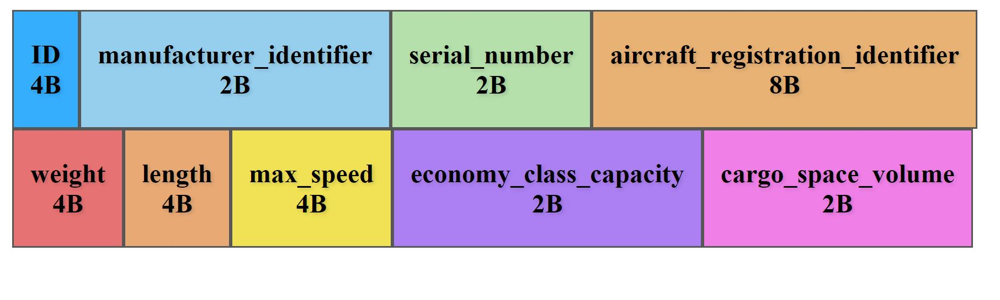

# Principles of data organisation HW 1

## Task 1
**id(primary_key)**: 4 B

Since 3 B is not sufficient due to the number of records in our dataset.

**manufacturer_identifier**: 2 B

Well since there are only 4 possible values, in theory we need only two bits.
We will represent this as string of 2 chars (e.g. mapping Airbus => Ai, Boeing => Bo, ...). Letters only.

**serial_number**: 2 B

This number highly depends on the application requirements, but since we can assume that new planes(from single manufacture) are not produced in high rate, we can expect that 2 B will be sufficient enough. (lets say there will be smth like 10-ths serial numbers for given manufacturer)

(e.g. ushort)

**aircraft_registration_identifier**: 8 B

String code identifier(capital letters + numbers 0-9). This identifier is supposed to be world wide unique for currently existing planes. 
But based on this [search](https://www.google.com/search?q=is+aircraft+Registration+Number+unique%3F&oq=is+aircraft+Registration+Number+unique%3F&gs_lcrp=EgZjaHJvbWUyBggAEEUYOTIICAEQABgWGB7SAQg0MjE1ajBqN6gCALACAA&sourceid=chrome&ie=UTF-8) it is possible that there could be some(few) duplicates in our database if
this registration identifer was reused... (and we have records of some old planes etc...)

=> this will be my choice for the secondary index. It is expected to be mostly unique but also is interesting enough to search based on it.
(also we build lexical sorting above it, where lets say all letters are greater than all numbers 0-9)

**weight**: 4 B

Specifies weight of the airplane in tons (with e.g. float IEEE 754 floating point presition). 

**length**: 4 B

Specifies length of the airplane in meters. (again e.g. float)

**max_speed**: 4 B 

Specifies maximal speed of the airplane in km/h. (again float)

**economy_class_capacity**: 2 B

How many passagers aircraft can have at once in economy class. (e.g. ushort)
(if there are no classes, we assume that it is the general capacity... 
e.g. ballon have 6, )

... I chosed economy class specifically since the upper bound is smth like 439 seats in 
A380 ... but choosing all the seats (853) would be probably too much for the purposes of the task 3... 

**cargo_space_volume**: 2 B

Total cargo space size in m^3.

=> Total record size: **32 B**

## Task 2

### Primary key direct index
First we expect to have all the records to be sorted and stored in the primary file.

Blocking factor of the primary file is:
$b_{primary}=4096/32= 128$ (lower whole part)

(since our record has size 32 B and we have 4 kB pages)

Number of the 4 kB pages in the primary file is then:

$pageCount_{primary}=20000000/128= 156250$

(we divide number of recors by the blocking factor for the primary file)

For the index it self we have record composed of our primary key (**id** attribute) and pointer which is 4 B. So we have 8 B record size in the index.

$b_{index}=4096/8 = 512$ (lower whole part)

The number of pages on each lvl of our index can be found as follows(using the formula from the slides):

$p_{0} = 156250 / 512 = 306$ (upper whole part)

(on the 0 th lvl we are addressing directly the primary file pages)

$p_{1} = 306 / 512 = 1$ (upper whole part)

Thus the total number of pages in our index is 306 + 1 = 307. The index will have height 2.

The total size of the index it self is: 

307 * 4096  = 1.2 MB  (# pages times size of page in Bytes)

## Secondary key direct index:
For the secondary key I decided to choose the **aircraft_registration_identifier** since it is mostly unique sortable identifier. 

Now the size of the index record is composed of the attribute (8 B) and pointer to the next page (4 B).
So total size of our record in the index structure is  12 B.

Thus the index blocking factor is:

$b_{index} = 4096 / 12 = 341$ (lower whole part)

But to be able to search properly we need to add another lvl, new 0-th lvl into our index from the direct index, which will be sorted by the attribute value. For every primary file page we will add new page in the 0-th lvl.

The number of pages on each lvl of our idex is:

$p_{0} = 20000000 / 341 = 58652$ (upper whole part)

(this is also the number of pages in the primary file, so we start by 20000000)

$p_{1} = 58652 / 341 = 172$ (upper whole part)

$p_{2} = 172 / 341 = 1$ (upper whole part)

So our index tree for secondary key direct index will have height of 3. 
The total number of pages in the index is 58652 + 172 + 1 = 58825. 
Which is significant increase from the direct index of the primary key.

And the total size is: 

58652 * 4096 = 229.1 MB

### Secondary key indirect index
Here we will have to calculate two blocking factors one for the first layer and one for all the others.

In the first layer we will have tuples of secondary key (8 B) and primary key index (4 B). So total size of the record will be 12 B.

In the subsquent layers we will have secondary key (8 B) and pointer to a page (4 B). So in total again 12 B.

The consequence of the same recors sizes is, that the blocking factors will be actually the same (but generally if the primary key size would be distinct from the pointer size, we could get different blocking factors):

$b_{firstLayer} = b_{secondLayer} = 341$ (lower whole part)

Calculation of the layers. 
For the first (or 0-th lvl) we would use normally $b_{firstLayer}$ (on the total number of records in the primary file) and for all the subsequent layers we would use $b_{secondLayer}$.

But since these blocking factors are equal we would get the same calculation as in the secondary key direct index above. 
As well as we would get the same number of pages in our index and same goes for the total index size.

So in summary we can see that to search by the primary key is definetly cheapest in terms of the memory and also since the height of the tree is from all the indexes smallest we can conclude that search will be also the fastest.

(I hope I didn't make the silly mistake that was pointed out on the lecture here, but it makes sense not to include the base layer to the index size, since it is the layer of the primary file...)

In the second scenarion where we are trying to search by secondary key we found out that both methods, direct and indirect indexing takes same amount of space. This is because indirect indexing has the pointer to the page and primary key of the same size (4 B), thus the both blocking factors are of the same size, and hence the calculation for the number of pages per layer is same as in the secondary direct index case.

So if we want to build index by the second key... we have two almost identical options(based on the storage size...). But the main advantage of the indirect indexing is that whenever we want to change the primary file(adding, deleting new records, moving, ...), the only thing that needs to be updated is the 0-th layer (and not the whole index).

## Task 3
For this task i decided to create bitmap over passangers_capacity attribute. For the commercial airplanes in economy class we can have capacity up to 439 passagers (we can round this to 400 just for the simplicity...)

### First approach
For each capacity separete column.
The total number of pages needed will be:

$pagesCount=20000000/(4096 \cdot 8)=610$

(number of records divided by the product of page size times size of byte)

The total size such bitmap would take is then:

$totalSize=400 \cdot 610 \cdot 4096 \approx 953.13$ MB

**Pros:**
 - Single read of appropirate column can return us all the aircrafts with specific capacity.
 - Search for the column is fast(only comparing numbers)
 - We can easily add new column, if maximal capacity increases...
 
**Cons:**
 - Large amount of memory, but we also have many records.

### Alternative approach
We will split the bitmap to multiple bitmaps by intervals of capacity(basically we will build kind of one level tree above it).

On the first lvl we will have bitmap that will split our data into lets say 4 intervals, by the capacity. We will get:

- [0..100]
- [0..200]
- [0..300]
- [0..400]

So the first search will only find the specific interval to which capacity falls into.

For each of the intervals above, we will create an separate bitmap containing 100 columns. The search is then & of the results from the first interval bitmap and of the results from the second bitmap.

The size of the interval bitmap will be:

$totalSize_{intervalBitmap}=4 \cdot 610 \cdot 4096 \approx 9.53$ MB

And total size of the actual search bitmap:

$totalSize_{searchBitmap}=100 \cdot 610 \cdot 4096 \approx 238.28$ MB

Note we could maybe split it 2 times more (to get intervals by 50) so the final bitmap size would be e.g. only around 60 MB.

**Pros**

 - The search can be faster. 

 - Since the bitmap is fragmented now into smaller pieces we can load(cache) some of these bitmaps into the memory, for faster search(for e.g. time locallity enhancement).

**Cons**

- Bit larger time overhead when creating the interval bitmap since we have to find out to which category each record falls in to... 

- Similarly when increasing maximal capacity.

- Acutally the total size overhead is a bit larger.

$totalSize=totalSize_{intervalBitmap} + 4 \cdot totalSize_{searchBitmap} = 962.65$ MB

Both of these approaches are not very optimal and maybe the first approach is slightly better in general in todays system, where the operation memory is not a problem. 
But honestly I really couldn't came up with a better example... I could used similar example like from the lecture with the date (e.g. **manufacture_date**) or in abstract an similar concept, where you have single attribute that actually is made up of two differentiable parts (like e.g. if you would combine the **manufacturer_identifier** with **serial_number** as e. g. new attribute **aircraft_name** (e.g. Boeing 777)) but I didn't want it to be too similar to the lecture. 

## Task 4

We have following parameters:
- rotation_speed = 7200 RPM (rotations per minute)
- r = 60000/7200 = 8.3 ms (60(minutes) * 1000 to rotation in milliseconds)
- s = 8.5 ms (avg seak time)
- TC = 0.3 MB

### If we would read only the record itself

For now lets consider just a case where we would read directly the record from the drive:

The record size is: B = 32 B = 0.000032 MB (here I am converting as regular 1 B = 1 MB * 1/1000000)

So if we plug in the values just for the record we will get:

$btt = \frac{2 \cdot 8.3}{0.3} \cdot 0.000032 = 0.00177$ ms

$T = 2 \cdot (8.5 + 8.3 + 0.00177) + 2 \cdot 8.3 + 0.00177 = 50.2$ ms

### Including indexing

But... since we are talking here about the indexing, we have to take in consideration also the read times we need while searching in the index... 

Also the calculation above was just an example, since what we are really doing is reading data in form of 4 K pages into the RAM and from here we are reading and searching in the indexes. We will also ignore the time needed for these RAM(or CPU chache) accesses, since they are typically way faster than HDD reads...

So if we take into consideration our direct primary index, we know that our index tree height is 2. Also we know that we have one primary file from which we will need to read the final record. In total we have 3 loads of pages in to our RAM memory. 

So in order to read an 4 K page (B = 0.004096 MB) we need:

$btt = \frac{2 \cdot 8.3}{0.3} \cdot 0.004096 = 0.227$ ms

$T = 2 \cdot (8.5 + 8.3 + 0.227) + 2 \cdot 8.3 + 0.227 = 50.9$ ms

So the time needed to read the page is 50.9 ms.
(interestingly this time is very similar to the time of reading single record directly from the disk)

So to read all the index pages while traversing the search tree including the page in the primary file is:

$50.9 \cdot 3 = 152.7$ ms

The total real time to read the record then depends on the speed of RAM/CPU caches... how fast we will actually find the next page to go to in our index etc... 

## Task 5

The main difference between HDD and SSD is in the way of storing information. 
HDD is mostly mechanical device, which uses rotational disks and moving head to read/write data to the disk(or multiple disks, with multiple heads). 
The data itself (the distinct bits) are represented using magnetic fields. 
Reading head then detects the presence/absence of this magnetic field which is then interpreted as binary 1 or 0. 

On the other hand solid state drives(SSD) have typically no moving parts and storing of information is done purly electrically in whats called flash memory. Due to the physical properties, these memories are not very well suited for huge number of writes (with each write to a memory cell, this cell degradates), and have typically smaller capacity against classical HDDs. On the other hand SSDs are typically much faster than HD drives and less less prone to mechanical demage. Due to this properties SSDs are typically used in scenearios where we need fast read/write but we don't need wast amount of memory and the writes are limited. Typicall usecase for SSDs is storage for operating system and other programs.
Another great advantage of SSDs over HDDs is typically better energy efficiece, so 

HDDs are used nowdays typically in personal computers as more persistant data storage(meaning the data that are not frequently used), e. g. for larger files as images, videos etc. 

Even though SSDs are faster and less prone to mechanical demage, still majority of server cloud storages uses HDDs, even though they need to be more frequently replaced. The main reason is still price to storage capacity efficiency.
